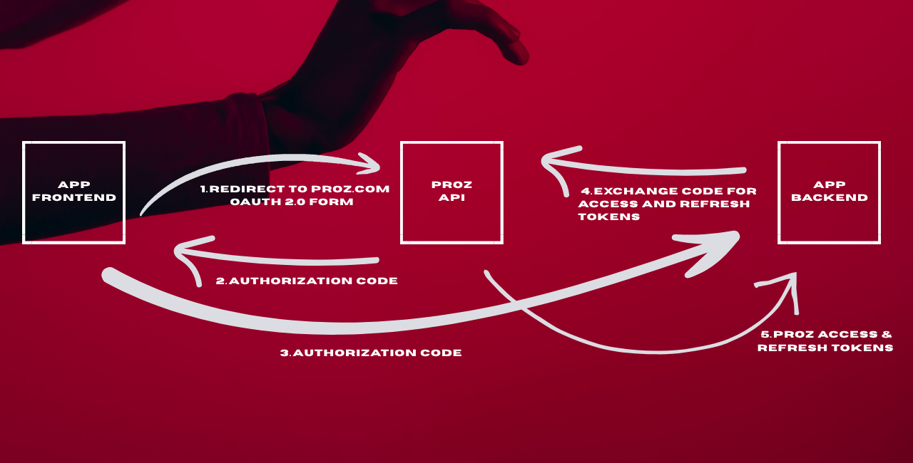
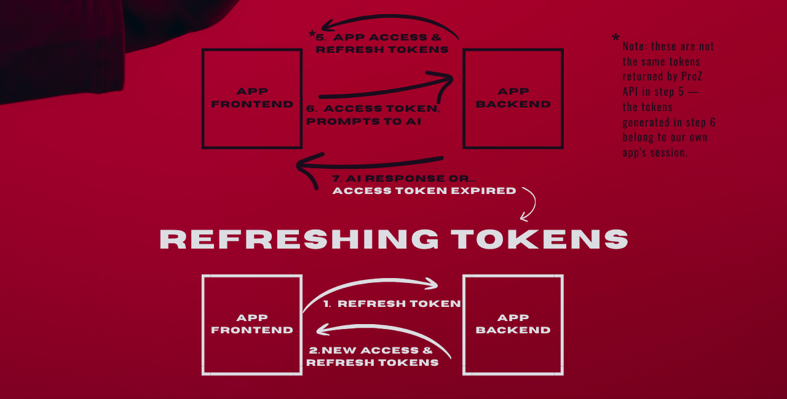

# Overview
This document is a record of how I approached the project, what trade-offs I considered and why I ended up with certain design decisions.

Since AI can generate both code and docs surprisingly well nowadays, I think the reasoning behind the implementation is much more interesting than the implementation itself.

The core problem: in some apps, users need to make LLM calls, but that's
actually quite problematic as:
- letting users manage their own AI service keys might discourage less tech-savvy users
- even if we provide keys ourselves, it's hard to prevent unauthorized access: a secret key embedded in client-side code can be extracted via reverse engineering, browser dev tools, or a man-in-the-middle proxy on the user's own device

So I designed an OAuth 2.0 + JWT flow that allows authorized users to access the most popular
LLMs. In this case, "authorized" means registered users on ProZ.com.

# Domain
For more serious projects I always start with coding the business logic. I like this approach for a few reasons:
- it's easy to start: all I need to do is describe what makes our project unique
- this kind of separation of responsibilities makes testing, as well as debugging, very easy
- I can always change the database provider, security algorithms etc. without any changes to that layer

The common architecture pattern for this case is "ports & adapters". It's really well described by ArjanCodes [here](https://www.youtube.com/watch?v=FXwBWS4qDAA&t=4s).

## Chat
In our case, the core business logic is quite simple. We know for sure that we need a function which:
 - gets user prompts
 - calls the LLM API to get a response based on the prompts
 - (optional) gets details such as model, operation costs etc.
 - (optional) saves such info somewhere
 - returns the LLM response

So it can be described as simply as this:
```python
# get_chat_response.py
@dataclass(frozen=True)
class ChatUseCase:
    chat: ChatServicePort
    db: ChatDatabasePort


async def get_chat_response(
    prompts: ChatPrompts,
    use_case: ChatUseCase,
) -> str:
    """Generates a response for the user based on prompts.

    Raises:
        UnavailableError: if any service is down

    """
    answer = await use_case.chat.get_response(prompts=prompts)
    details = use_case.chat.get_details()
    await use_case.db.save_chat_details(user_id=prompts.owner, details=details)
    return answer
```
```python
# ports.py
class ChatDatabasePort(Protocol):
    async def save_chat_details(self, user_id: UUID, details: ChatDetails) -> None: ...


class ChatServicePort(Protocol):
    async def get_response(self, prompts: ChatPrompts) -> str: ...
    def get_details(self) -> ChatDetails: ...
```
```python
# models.py
@dataclass(frozen=True)
class ChatPrompts:
    owner: UUID
    system_prompt: str
    user_prompt: str


@dataclass
class ChatDetails:
    model: str
    cost_usd: Decimal
    tokens_total: int

    def __post_init__(self) -> None:
        self.cost_usd = Decimal(str(self.cost_usd))
```
> In the final version of the app, I decided to stream the response in chunks to reduce perceived latency. Users start seeing the answer immediately instead of waiting for the full response to generate.

```python
async def stream_chat_response(
    prompts: ChatPrompts,
    use_case: ChatUseCase,
) -> AsyncGenerator[str, None]:
    """Streams a response for the user based on prompts.

    Raises:
        UnavailableError: if any service is down

    """
    async for chunk in use_case.chat.run_stream(prompts=prompts):
        yield chunk

    details = use_case.chat.get_details()
    await use_case.db.save_chat_details(user_id=prompts.owner, details=details)
```

## Auth
It's more complex here as we need to design two key mechanisms:
- OAuth 2.0 to authenticate new users via ProZ.com
- our own authentication system to manage existing users

### 1. OAuth 2.0
It's a common protocol to authorize users in our app via third-party sites. The flow designed for our app looks like this:


> A more popular approach for step 2 is to call our app's API directly. However, in this app the frontend for this backend runs on the user's desktop. In that case, the frontend developer had to:
> - set OAuth 2.0 client to redirect to localhost
> - open a server on the user's machine
> - catch the code sent to this server
> - and then call our API with that code

The API receives this code and calls a function that handles the code exchange use case:
```python
async def exchange_token(code: str, use_case: CodeExchangeUseCase) -> Tokens:
    proz_tokens = await use_case.proz_client.exchange_code_for_tokens(code=code)
    ...
```
Once we have the ProZ tokens, we can use them to perform actions on behalf of the user. In this specific example, we just fetch some basic info about the token's owner.
```python
    ...
    proz_user = await use_case.proz_client.get_token_owner(
        access_token=proz_tokens.access_token,
    )
```

### 2. Our Auth System
Now that we know who owns the tokens, we need to generate our own:
- access token which is required to use LLMs in our app, but it has a limited lifetime
- refresh token to get new access tokens; refresh tokens are rotated each time a new one is issued



Note that we now have two different pairs of tokens: ProZ.com's and our own.

### 3. Combining Two Systems

```python
# exchange_token.py
async def exchange_token(code: str, use_case: CodeExchangeUseCase) -> Tokens:
    """Authorize user and register in database.

    Raises:
        UnauthorizedError: if ProZ code invalid
        UnavailableError: if any service is down

    """
    # fetch info about proz user
    proz_tokens = await use_case.proz_client.exchange_code_for_tokens(code=code)
    proz_user = await use_case.proz_client.get_token_owner(
        access_token=proz_tokens.access_token,
    )

    # generate authentication tokens
    tokens = use_case.token_service.generate_token_pair(user_id=proz_user.id)

    # upsert to database
    await use_case.db_cmd.upsert_proz_info(
        proz_user=proz_user,
        plain_proz_refresh_token=proz_tokens.refresh_token,
        plain_refresh_token=tokens.refresh_token,
    )

    return tokens
```

Then, if the access token expires:
```python
# refresh_token.py
async def refresh_token(
    plain_refresh_token: str,
    use_case: TokenRefreshUseCase,
) -> Tokens:
    """Exchanges an old token for a new one.

    Raises:
        UnauthorizedError: if old token not in database
        UnavailableError: if any service is down

    """
    # compare the requested token with the one stored in the database
    user_id = await use_case.db_query.get_token_owner(plain_token=plain_refresh_token)

    # generate authentication tokens
    tokens = use_case.token_service.generate_token_pair(user_id=user_id)

    # save data in database (hashing takes place within the adapters)
    await use_case.db_cmd.update_session(
        user_id=user_id,
        plain_refresh_token=tokens.refresh_token,
    )

    return tokens
```

Note that we're still hiding implementation details here, since the purpose of this section is only to describe the flow. In the next section, I'll show how we handle token generation and secure data storage.

# Adapters
I will write this section in my free time.